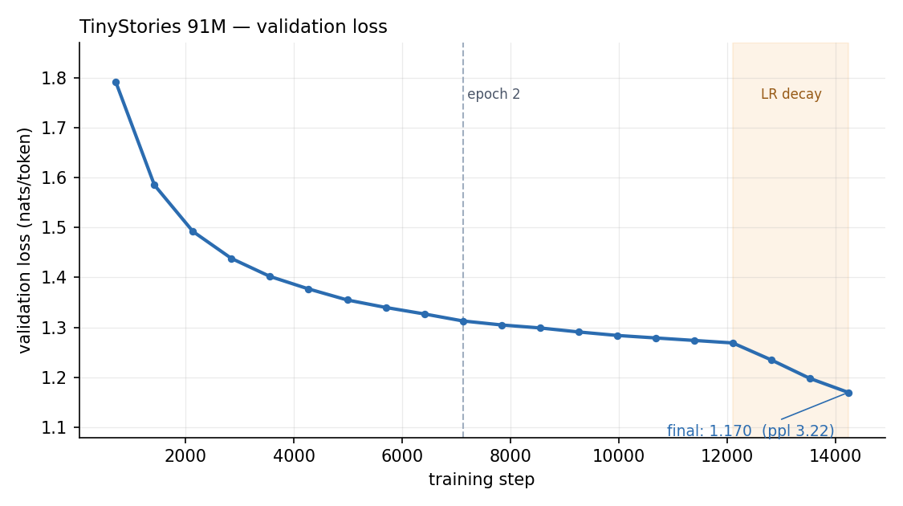

# TinyStories-91M

A 91M-parameter decoder-only language model, written from scratch in PyTorch and
trained on [TinyStories](https://huggingface.co/datasets/roneneldan/TinyStories)
[(Eldan & Li, 2023)](https://arxiv.org/abs/2305.07759). It reaches **1.170
validation loss (perplexity 3.22)** after 49 minutes on a single A100, and writes
coherent multi-paragraph children's stories with dialogue, named characters, and
a beginning–middle–end structure.

I implemented most things like rotary embeddings, SwiGLU, weight tying, the LR schedule, and KV-cached decoding.

<p align="center">
  
</p>

prompt> Once upon a time, a little boy named Camil

```
Once upon a time, a little boy named Camil lived in a small house with his mom.
Camil's mom was very strict and always said: "Camil, you must behave!"

One day, Camil wanted to play with his toys outside. As he went outside, he saw
some police officers. Camil was a little scared, but he remembered to behave.
He said hello to the police officers.

The police officers smiled and said: "Hello there! We see you have a good life." 
Camil smiled and said: "Thank you! I'm just a little boy and I just wanted to play."
The police officers thanked Camil and said: "You are very polite. Please remember to always be careful and behave."
Camil nodded and said: "I will! Thank you for being so nice!"
```

More in [`assets/samples.md`](assets/samples.md), including the failure modes.

---

## Architecture

A Llama-style pre-norm decoder stack
[(Touvron et al., 2023)](https://arxiv.org/abs/2307.09288).

| Component | Choice |
|---|---|
| Parameters | 91,245,312 |
| Layers / heads / `d_model` | 12 / 12 / 768 |
| Head dim | 64 |
| FFN | SwiGLU, `d_ffn` = 2048 (⁸⁄₃·`d_model`, rounded to a multiple of 256) |
| Normalisation | RMSNorm, pre-norm placement | 
| Positions | RoPE (θ = 10,000), applied in fp32 | 
| Vocabulary | 8,192 byte-level BPE, trained on the corpus |
| Context | 512 train / 1,024 RoPE table | 
| Embeddings | Input and output weights tied | 
| Attention kernel | `F.scaled_dot_product_attention` (FlashAttention-2 path) |
| Init | `N(0, 1/√d_model)`, residual projections scaled by `1/√(2N)` | 

A couple Design Choices :

- **Residual-scaled init.** Output projections (`w_o` in both attention and the
  FFN) get an extra `1/√(2N)` factor. This is the GPT-2 trick: without it, the
  variance of the residual stream grows linearly with depth, since each of the
  `2N` sublayers adds to it, and early training is unstable.

- **RoPE table longer than the training context.** Rope table is 1,024 while the training is at 512 tokens, so the generation can run past the training length with the same cos/sin tables. 

- **RoPE in fp32.** The rotation is done in float32 and casts back, so bf16 autocast this is for precision.

- **Packed sequences, no padding.** Every story is wrapped in `<bos>`/`<eos>`, concatenated into one flat token array, and cut into 512-token windows. See Known issues for the cross-document caveat this introduces.

## Training

| | |
|---|---|
| Data | 2.11M stories → 466.6M tokens | |
| Schedule | 2 epochs, 14,238 steps, 933M tokens seen | |
| Batch | 128 × 512 = 65,536 tokens/step | |
| Optimiser | AdamW (fused), β = (0.9, 0.95), wd = 0.1 | 
| Grad clip | Global norm 1.0 | 
| LR | 1e-3 — WSD: 3% linear warmup → constant → 15% linear decay to 0 | 
| Precision | bf16 autocast, `torch.compile` | 
| Hardware | 1× A100 40GB (Colab) | |
| Wall clock | 49 min (~318k tokens/s) | |


## Results

| Checkpoint | Val loss | Val PPL | 
|---|---|---|
| End of epoch 1 | 1.314 | 3.72 | 
| End of epoch 2 (final) | **1.170** | **3.22** |

At 933M training tokens for 91M parameters, this run sits at ~10 tokens per parameter, which is roughly half the ~20:1 ratio [Hoffmann et al. (2022)](https://arxiv.org/abs/2203.15556) identify as compute-optimal , so the model is
somewhat under-trained for its size.

Qualitatively it handles what TinyStories was built to probe: grammatical
English, character names held consistent across paragraphs, quoted dialogue with
correct attribution, and stories that actually resolve. Eldan & Li's central
result is that this kind of fluency and consistency emerges at parameter counts
far below what general-purpose corpora require, while factual and reasoning
ability does not, which is exactly the split visible here. See the failure modes
in [`assets/samples.md`](assets/samples.md).

## Repository layout

### `src/`
- `config.py` : Hyperparameters and cache paths
- `model.py` : RoPE, causal multi-head attention with KV cache, SwiGLU, decoder stack
- `data.py` : BPE training, packed dataset, disk cache, and dataloaders
- `train.py` : Training loop, learning rate schedule, validation, and checkpointing
- `generate.py` : KV-cached top-k sampling and command-line interface

### `notebooks/`

- `train_tinystories.ipynb` : Original Colab training run with its training log

### `assets/`

- `val_loss.png` : Validation loss curve
- `samples.md` : Generated samples and failure modes

## Usage

```bash
pip install -r requirements.txt

python -m src.train                                    # ~49 min on an A100
python -m src.generate --prompt "Once upon a time"
python -m src.generate                                 # interactive REPL
```


## Known issues

- **Cross-document attention in packed sequences.** A 512-token window can span several stories, and the causal mask does not prevent a token from attending across an `<eos>` boundary into an unrelated story. This is the usual approach (GPT-2, GPT-3, most open pretraining runs) and it is efficient, but [Zhao et al (2024)](https://arxiv.org/abs/2402.13991) showed intra-document masking measurably improves perplexity because it removes distractions. On TinyStories, where documents are short relative to the window, several stories share each sequence, so the
  effect here is plausibly larger than on long-document corpora. 

- **No weight-decay parameter groups.** `weight_decay=0.1` is applied uniformly, including to RMSNorm gains and the tied embedding. The standard convention (GPT-3, nanoGPT) excludes 1-D parameters, since decaying a normalisation gain toward zero has no regularising interpretation. Nonetheless, the effect here is small.
- **Mojibake in the vocabulary.** Some TinyStories rows are UTF-8 text that was decoded as cp1252. `fix_mojibake` in `src/data.py` repairs most of these issues, but a few corrupted byte sequences ended up in the BPE merges and occasionally surface at generation time as `“`.
- **No benchmark.** The only quantitative metric is the validation loss on the TinyStories validation split. There is no GPT-graded evaluation of grammar, consistency, and creativity as in the original TinyStories paper.

## Next steps

- **Intra-document masking**
- **Grouped-query attention** 
- **A `(1-√x)` cooldown shape** instead of linear decay for the LR scheduler